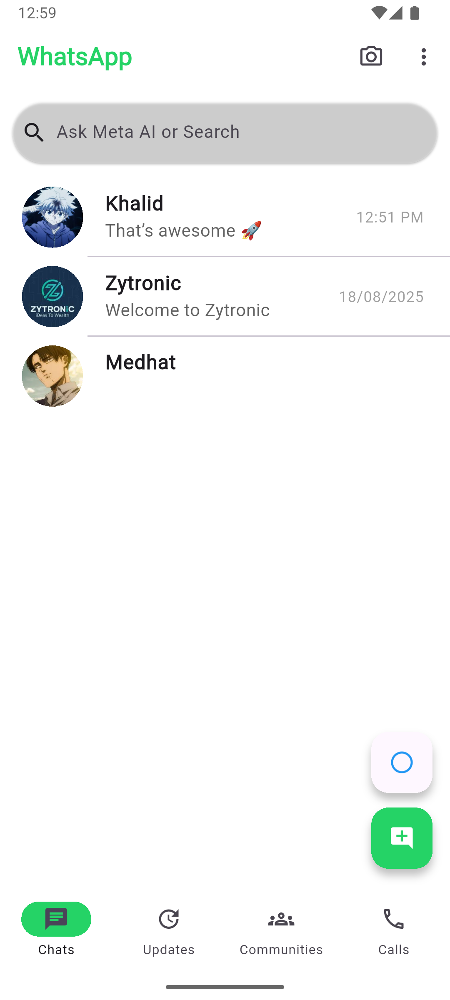
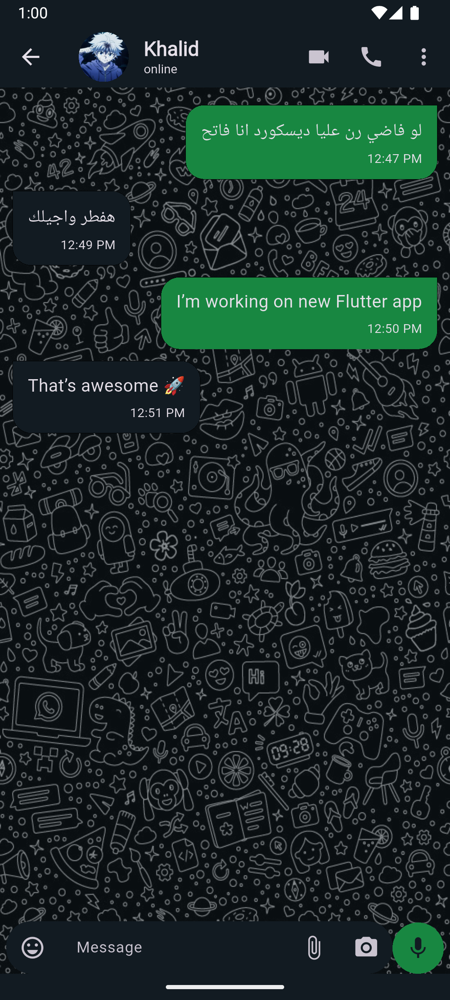
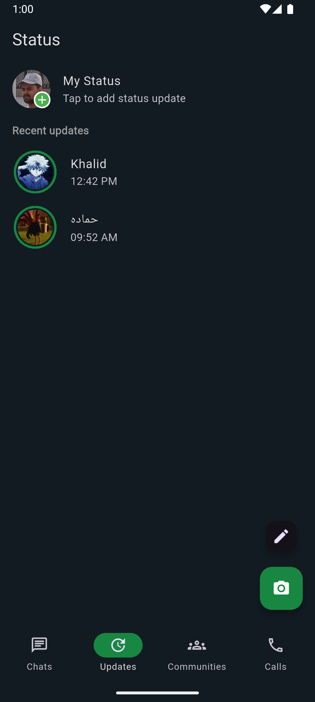

# WhatsApp Clone App

A **Flutter-based WhatsApp UI clone** using dummy data. This project demonstrates Flutter UI design with chats, statuses, bottom navigation, and responsive layouts.

## Features

- Pixel-perfect WhatsApp UI clone

- Chats, statuses, and bottom navigation

- Responsive layouts for different screen sizes

- Dark and Light theme support

- Send messages in real-time: Users can type and send messages that appear instantly (temporary and disappear when the app restarts)

- Message animations: Messages slide in and fade smoothly when appearing

- Animated status timers: Status progress bars are smooth and controlled by AnimationController

## Project Structure

```
lib/
├── Controller/
│   └── controller.dart
├── Model/
│   ├── chat.dart
│   ├── message.dart
│   ├── status.dart
│   └── user.dart
├── View/
│   ├── chatScreen/
│   │   └── Widgets/message_bubble.dart
│   │   └── chatScreen.dart
│   ├── homeScreen/
│   │   └── Widgets/chat_list_item.dart
│   │   └── homeScreen.dart
│   └── statusScreen/
│       └── Widgets/user_status_tile.dart
│   │   └── statusScreen.dart
├── dummyData.dart
├── appTheme.dart
├── main.dart
└── pageView.dart
```

## Setup Instructions

1. **Create a new Flutter project**

```bash
git clone https://github.com/AbdelrahmanHamdyDev/whatsapp_clone.git
```

2. **Install dependencies**

```bash
flutter pub get
flutter create .
```

3. **Generate Native Splash Screen**

```bash
flutter pub run flutter_native_splash:create
```

4. **Generate App Launcher Icons**

```bash
dart run flutter_launcher_icons
```

5. **Run the project**

```bash
flutter run
```

## Screenshots

| Home Screen                         | Chat Screen                          | Status Screen                            | Status Viewer                              |
| ------------------------------------ | ------------------------------------ | ---------------------------------------- | -------------------------------------------- |
|  |  |  |  |


## 📄 License

This project is for **educational purposes** only.

